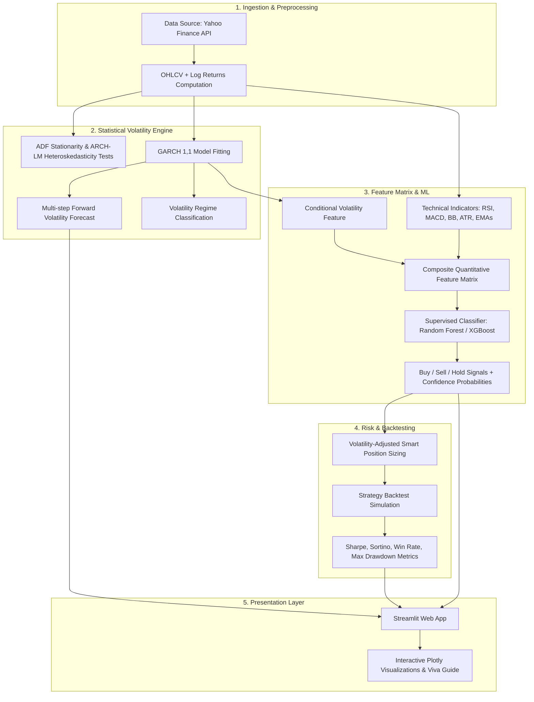

# ⚡ Crypto Volatility Forecast & Smart Trading Signal Generator

**A Final Year CSE Major Project**  
*An End-to-End Quantitative Econometric Modeling (GARCH) & Supervised Machine Learning Trading Signal System with Interactive Streamlit Dashboard.*

---

## 📌 Project Overview

Cryptocurrency markets are known for extreme price fluctuations, regime shifts, and **volatility clustering** (turbulent periods follow turbulent periods). Standard trading strategies and machine learning models often fail because they ignore time-varying conditional variance.

This project delivers a hybrid framework combining:
1. **Econometric Time-Series Modeling (GARCH/EGARCH)** to forecast conditional variance and classify market volatility regimes (Low / Medium / High).
2. **Technical Feature Engineering (RSI, MACD, Bollinger Bands, ATR)** merged with GARCH volatility estimates.
3. **Supervised Machine Learning Classifiers (Random Forest, XGBoost)** trained with strictly chronological walk-forward splits (zero lookahead bias).
4. **Quantitative Backtesting Engine** simulating strategy execution with realistic transaction costs and **volatility-adjusted position sizing**.
5. **Interactive Streamlit Web Dashboard** featuring real-time data ingestion, interactive Plotly charts, live signal triggers, and complete project viva documentation.

---

## 🏛️ System Architecture



---

## 📁 Project Directory Structure

```text
majoranti/
│
├── app.py                      # Main Streamlit Interactive Dashboard
├── requirements.txt            # Project dependencies
├── README.md                   # Complete documentation
│
└── src/                        # Modular source code
    ├── __init__.py
    ├── data_loader.py          # Data ingestion, cleaning, and log returns
    ├── volatility_engine.py    # ADF test, ARCH-LM test, GARCH(1,1), forecasting, regimes
    ├── feature_engineering.py  # RSI, MACD, Bollinger Bands, ATR, GARCH feature merger
    ├── ml_signal_generator.py  # Random Forest / XGBoost training, signals, feature importance
    ├── backtester.py           # Vectorized backtesting, transaction costs, Sharpe ratio, MDD
    └── visualizer.py           # Plotly candlestick, volatility, and equity charts
```

---

## ⚙️ Installation & Running

### 1. Prerequisites
- Python 3.9+ installed on your system.

### 2. Install Dependencies
```bash
pip install -r requirements.txt
```

### 3. Launch Streamlit Web Application
```bash
streamlit run app.py
```

---

## 📐 Mathematical Formulation

### 1. Log Returns
$$r_t = \ln\left(\frac{P_t}{P_{t-1}}\right) = \ln(P_t) - \ln(P_{t-1})$$

### 2. GARCH(1,1) Conditional Variance
$$r_t = \mu + \epsilon_t, \quad \epsilon_t = \sigma_t z_t, \quad z_t \sim \text{i.i.d. } \mathcal{N}(0, 1)$$
$$\sigma_t^2 = \omega + \alpha \epsilon_{t-1}^2 + \beta \sigma_{t-1}^2$$
- $\omega > 0$: Baseline constant variance
- $\alpha$: Sensitivity to recent price shocks (ARCH effect)
- $\beta$: Persistence of historical variance (GARCH effect)
- Mean reversion condition: $\alpha + \beta < 1$

### 3. Volatility-Adjusted Smart Position Sizing
$$S_t = \text{Signal}_t \times \min\left(1.0, \max\left(0.4, \frac{\text{Median}(\sigma)}{\sigma_t}\right)\right)$$

---

## 🎯 Evaluator / Viva Key Points
- **Zero Lookahead Leakage**: No random train/test shuffling; chronological walk-forward splits only.
- **Statistical Grounding**: ADF and ARCH-LM tests mathematically justify the use of GARCH before modeling.
- **Hybrid Alpha**: Combines statistical econometrics (GARCH) with machine learning (Random Forest / XGBoost).
- **Realistic Backtest**: Evaluates transaction costs, drawdown curves, and Sharpe/Sortino ratios.
